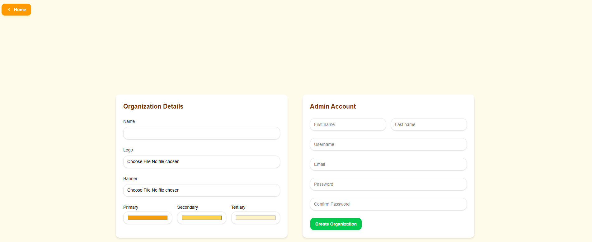
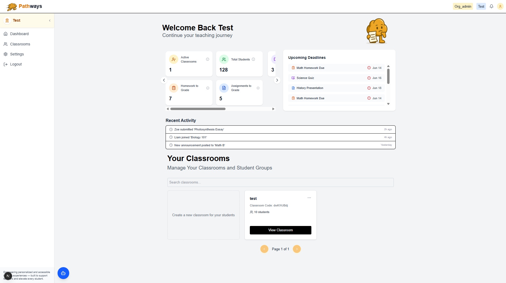
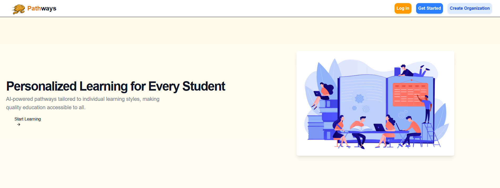
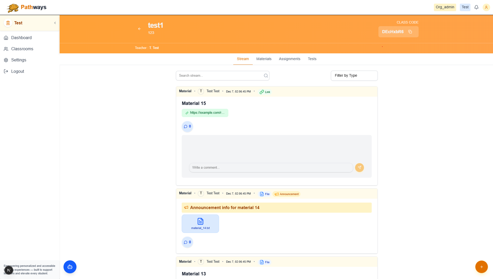
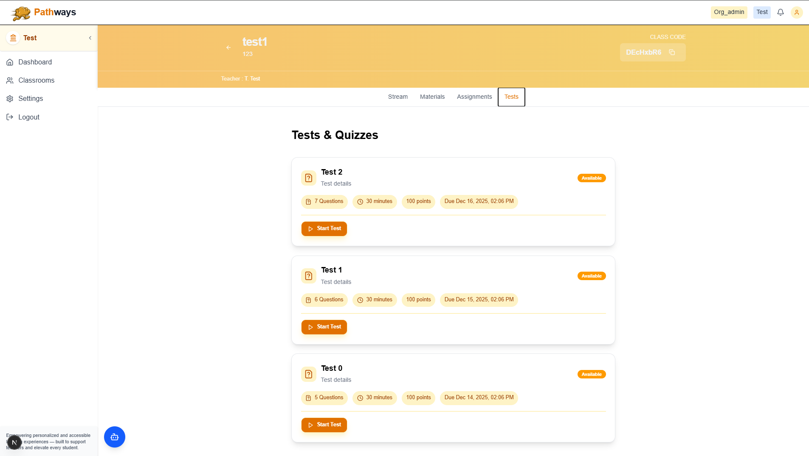

# Pathways

Pathways is an AI-assisted Learning Management System (LMS) built as part of the LectureAssistant project.

This README is split into two clear parts:

* What the application does (user-facing / product features)
* How the application is implemented (technical components and local dev notes)

---

## 📌 What the application does (product features)

Pathways helps educators and organizations run classrooms, monitor learners, assign and grade work, and apply AI-assisted insights.

---

### **🏫 Multi-tenant Organization Support**

Users can create independent organizations with their own branding, admins, teachers, and students.
The onboarding flow includes uploading a logo/banner, and choosing theme colors.

**Organization Creation Page**

*Educators or institutions can set up branded organizations with custom colors, logos, and admin accounts.*

---

### **📊 Teacher Dashboard**

Once logged in, teachers land on a dashboard summarizing key metrics: active classrooms, homework to grade, upcoming deadlines, and recent activity.

**Dashboard Overview**

*Teachers see classroom summaries, tasks requiring attention, student activity, and quick navigation to classrooms.*

---

### **🎓 Public Landing Page**

This is what new visitors see when reaching the platform. It's designed to clearly present Pathways’ mission of AI-assisted personalized learning. The platform is fully secured including email/password authentication, CSRF protection, rate limiting, email verifiaction and seperated organization DBs to prevent data spillage.

**Landing Page**

*Marketing-facing landing screen describing personalized learning, with clear CTAs for login and organization creation.*

---

### **📚 Classroom Stream & Materials**

Each class contains tabs for stream updates, materials, assignments, and tests.
The **Stream** allows teachers to post lesson materials, announcements, and external resources.

**Class Stream View**

*Teachers can post materials, upload files, share links, make announcements, and interact with students’ comments.*

---

### **📝 Tests & Quizzes**

Teachers can create tests with multiple-choice questions, auto-grading, and availability windows.
Students see due dates, question counts, and test durations.

**Tests & Quizzes Page**

*Students view available tests with details such as points, duration, and deadlines.*

---

### Additional Core Features

* **Classroom & roster management:** Create classes, enroll students, and manage rosters.
* **Attendance tracking:** Record and export attendance.
* **Assignments & homework:** Create, submit, grade, and manage assignment workflows.
* **Agentic AI insights:** Learning recommendations, content search, and progress analysis.
* **Student dashboards:** Grades, attendance logs, submission history, and more.

---

## 🔧 How it's built (technical overview)

This section describes the architecture and development structure.

* **`App/backend/` (Django REST API):**
  Business logic for classrooms, assignments, quizzes, authentication, Org management, and media storage.

* **`App/pathways/` (Next.js Frontend):**
  UI for all user roles.

* **`App/LectureCreator/`:**
  Python utilities for generating lecture materials using AI.

* **`App/vector_data/`:**
  Semantic search (FAISS index + JSON mapping).

* **CI/CD:**
  GitHub Actions workflows and Firebase and GCP integration for deployments.

---

## 🚀 Quick Start (Development Setup)

Backend (Django):

```powershell
cd App\backend
python -m venv .venv
.\.venv\Scripts\Activate.ps1
pip install -r requirements.txt
python manage.py migrate
python manage.py runserver 0.0.0.0:8000
```

Frontend (Next.js):

```powershell
cd App\pathways
npm install
npm run dev
```

Set API base URL in `App/pathways/backendUrl.js` or `.env.local`:

```
NEXT_PUBLIC_API_URL=http://localhost:8000
```

---

## 🔐 Security & Credentials

* Never commit real service credentials—use `.example` files.
* Store keys in environment variables or ignored local config.
* Review `.github/workflows/` before enabling deployments.

---

## 🤝 Contributing

* Branch from `main`, open PRs with descriptions and tests.
* Backend tests:

  ```bash
  python manage.py test
  ```
* Follow component structure and linting for frontend.
